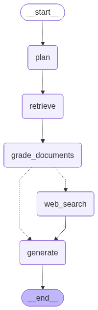

# Coach Copilot 🏋️‍♂️

**AI-powered Powerlifting Coach Assistant** built with **LangGraph**, **RAG**, and **NiceGUI**.

Coach Copilot is not just a chatbot; it's an **agentic system** that acts as a personalized powerlifting coach. It plans responses, retrieves knowledge from your trusted sources (PDFs, YouTube), validates relevance, and falls back to web search when necessary.



## 🚀 Key Features

* **🧠 Agentic Workflow (LangGraph)**:
  * **Planning**: Deconstructs complex user queries into an execution plan.
  * **Hybrid RAG**: Retrieves technical knowledge from local documents and YouTube transcripts.
  * **Self-Correction**: Grading node evaluates document relevance to prevent hallucinations.
  * **Web Search**: Falls back to DuckDuckGo for up-to-date information (e.g., "latest IPF rule changes").
* **📊 Data Integration**:
  * **Google Sheets**: Reads your actual training logs (Cycle/Block logic) to give context-aware advice.
  * **YouTube**: Indexes transcripts from coaching videos for style and knowledge alignment.
* **🛠️ Technical Tools**:
  * **Calculators**: Built-in 1RM, IPF GL Points, and Plate Loading tools.
  * **Memory**: Persists chat history for conversational continuity.
* **🎨 Modern UI**:
  * Built with **NiceGUI** (Python-only frontend).
  * Dark mode aesthetic with responsive design.

## 🏗️ Architecture

The system uses a **State Graph** architecture rather than a linear chain:

1. **Plan**: Analyze the user's request.
2. **Retrieve**: Fetch relevant chunks from ChromaDB.
3. **Grade**: LLM evaluates if chunks answer the question.
   * *If Relevant* → **Generate** answer.
   * *If Irrelevant* → **Web Search** → **Generate** answer.

### Tech Stack

*   **Orchestration**: `LangGraph`, `LangChain`
*   **LLM**: `Ollama` (Llama 3) / `Gemini 1.5 Pro`
*   **Vector Query**: `ChromaDB`
*   **Frontend**: `NiceGUI`
*   **Package Manager**: `uv` (Astral)
*   **Search**: `DuckDuckGo`

## 📦 Installation

This project uses `uv` for lightning-fast dependency management.

```bash
# 1. Clone the repository
git clone https://github.com/yourusername/coach-copilot.git

# 2. Install dependencies
uv sync

# 3. Set up environment
# Create .env file with your API keys (Gemini, etc.)
cp .env.example .env

# 4. Run the app
uv run coach
```

Open [http://localhost:8080](http://localhost:8080) to start coaching.

## 🧪 Development

The project is structured for modularity and scalability:

```
src/
├── agent/          # LangGraph agent logic
│   ├── graph.py    # State machine definition
│   ├── nodes.py    # Retrieval, Grading, Planning nodes
│   └── state.py    # Pydantic state schema
├── ui/             # NiceGUI frontend
├── tools.py        # Powerlifting calculators
└── rag.py          # Vector store management
```

Running tests:
```bash
uv run pytest
```

---
*Built by [Boldizsár Nagy](https://www.linkedin.com/in/boldizsarnagy/)*
